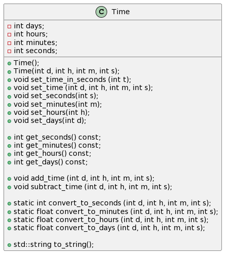

# UML-диаграмма

```text
@startuml
class Time 
{
  - int all_time;
  - int days;
  - int hours;
  - int minutes;
  - int seconds;


   + Time();                            
   + void convert_s_to_std ();                  
   + void set_time (int t);
   + void set_time (int d, int h, int m, int s);

   + int get_all_time() const;
   + int get_seconds() const;
   + int get_minutes() const;
   + int get_hours() const;
   + int get_days() const;  

   + void add_time (int d, int h, int m, int s);
   + void subtract_time (int d, int h, int m, int s);

   + static int convert_to_seconds (int d, int h, int m, int s);
   + static float convert_to_minutes (int d, int h, int m, int s);
   + static float convert_to_hours (int d, int h, int m, int s);
   + static float convert_to_days (int d, int h, int m, int s);

   + std::string show_time();   
}
@enduml
```


